# 🏢 SmartHostel AI Platform — Autonomous Campus Management System

[](https://share.streamlit.io/)
[](https://render.com/deploy?repo=https://github.com/PrajwalTR18/Hostel-Management-Using-AI)
[](Dockerfile)
[](https://www.python.org/)
[](LICENSE)

An enterprise-grade, real-world **AI-Powered University Hostel Management Platform** built with **Python**, **Streamlit**, and an **Autonomous Domain RAG AI Engine**. It provides role-based portals for Chief Administrators, Hostel Wardens, Security Officers, and Resident Students with biometric turnstile tracking, AI room-matching, automated NLP ticket triage, fee risk scoring, and a 24x7 database-grounded conversational AI assistant.

---

## 🌟 Key Features & Architecture

```mermaid
graph TD
    A[SmartHostel AI Platform] --> B[Multi-Role Auth Portal]
    A --> C[AI Intelligence Suite]
    A --> D[Operations & Services]
    A --> E[24x7 Grounded AI Chatbot]

    B --> B1[Chief Admin Dashboard]
    B --> B2[Warden Oversight Portal]
    B --> B3[Security Turnstile Post]
    B --> B4[Personalized Student Hub]

    C --> C1[Roommate Vector Compatibility Matcher]
    C --> C2[NLP Maintenance Ticket Triage & SLA Router]
    C --> C3[Biometric Attendance Anomaly Detector]
    C --> C4[Fee Default Risk & Overdue Forecaster]
    C --> C5[Mess Food Demand & Waste Optimizer]

    D --> D1[Digital Gate Passes & QR Scans]
    D --> D2[7-Day Dynamic Mess Menus & Nutrition]
    D --> D3[Visitor Security Checkpoint]
    D --> D4[Official Campus Circulars & Alerts]

    E --> E1[Live SQLite Database Grounding]
    E --> E2[Autonomous Domain RAG Engine]
    E --> E3[Multi-LLM Integration OpenAI/Gemini]
```



### 1. 🏢 Multi-Hostel Complex Infrastructure
- **6 Campus Blocks:** Aryabhata (Boys), Gargi Bhavan (Girls), CV Raman (PG Research), Sarojini Naidu (Girls PG), Kalam Innovation (Tech Hub), and Tagore Residence (Executive Co-ed).
- **52 Real-World Rooms:** Single, Double, Triple, and Quad units across Floors 1–5 with pricing, occupancy tracking, and amenity tags.

### 2. 🧠 Smart AI Engine & Analytics
- **Roommate Compatibility Scoring:** Multi-attribute cosine similarity based on sleep habits (Night Owl / Early Bird), study culture (Intensive / Group), cleanliness tolerances, and dietary preferences.
- **NLP Complaint Classification:** Automatic categorization into Plumbing, Electrical, Wi-Fi, Food, Cleanliness, or Security with sentiment polarity, priority rating, SLA calculation, and technician assignment.
- **Predictive Food Waste Analytics:** Daily meal headcount forecasting to reduce kitchen waste by ~30%.
- **Fee Overdue Risk Scoring:** Identifies overdue and partial balances with automated financial summaries.

### 3. 🤖 24x7 Grounded AI Assistant (Chatbot)
- Answers queries in natural language grounded directly in live database tables (rooms, roommates, meal menus, fee balances, gate passes).
- **Direct Action Execution:** Students can type `Report issue: Air conditioner leaking water in room A-102` to automatically create triaged maintenance tickets.
- Zero external API dependencies (runs locally on autonomous RAG engine with zero latency) or optionally connects to OpenAI/Gemini.

---

## 📊 Live Enterprise Mock Dataset

| Entity | Count | Highlights |
| :--- | :---: | :--- |
| 🏢 **Hostels** | **6** | Engineering, Girls, Research, Innovation & Executive complexes |
| 🛏️ **Rooms** | **52** | Diverse capacities, amenities (AC, Wi-Fi, Balcony), and live occupancy |
| 👨‍🎓 **Students** | **50** | Complete profiles across 12 departments with lifestyle vectors & parent info |
| 🛠️ **Complaints** | **32** | NLP-triaged tickets across 7 categories with SLAs and assigned technicians |
| 🏷️ **Biometric Logs** | **350** | 7-day turnstile gate history with in/out timestamps |
| ✈️ **Gate Passes** | **22** | Approved & pending outstation passes with digital QR data |
| 💳 **Fee Statements** | **50** | Detailed student ledgers with bank transaction IDs |
| 🍲 **Dining Meals** | **28** | Full 7-day 4-meal rotation with calorie and special item metrics |
| 🛡️ **Visitor Entries** | **16** | Security checkpoint logs with relation, phone & purpose |
| 📢 **Campus Notices** | **10** | Emergency, Maintenance, Mess, and Event circulars |
| 👥 **User Accounts** | **57** | Admin, Wardens, Security, and all 50 student credentials |

---

## 🔑 Demo Login Credentials

| Role | Username / Identifier | Password | Access Rights |
| :--- | :--- | :--- | :--- |
| **Chief Administrator** | `admin` | `admin123` | Complete campus management, room allocation, analytics |
| **Boys Warden** | `warden_rajesh` | `warden123` | Boys block oversight, room approvals, gate passes |
| **Girls Warden** | `warden_sunita` | `warden123` | Girls block oversight, room approvals, gate passes |
| **PG Research Warden** | `warden_anand` | `warden123` | Research hall administration |
| **Security Officer** | `security_gate` | `security123` | Turnstile gate scanner, visitor logging, pass validation |
| **Resident Students** | `STU-1001` to `STU-1050`<br>*(or `aarav`, `ananya`, `vikram`)* | `student123` | Student dashboard, roommate finder, gate passes, fees, chatbot |

---

## 🚀 Instant Deployment Guide

### Option 1: Streamlit Community Cloud (Recommended — Free & Instant)
1. Fork or push this repository to your GitHub account: `https://github.com/PrajwalTR18/Hostel-Management-Using-AI`
2. Go to [share.streamlit.io](https://share.streamlit.io/) and log in with GitHub.
3. Click **"New App"** and select:
   - **Repository:** `PrajwalTR18/Hostel-Management-Using-AI`
   - **Branch:** `main`
   - **Main file path:** `app.py`
4. Click **"Deploy!"** — Your AI platform will be live in under 2 minutes!

---

### Option 2: Deploy to Render
1. Click the button below:  
   [](https://render.com/deploy?repo=https://github.com/PrajwalTR18/Hostel-Management-Using-AI)
2. Render will automatically detect the [`render.yaml`](render.yaml) blueprint and [`Dockerfile`](Dockerfile).
3. Click **"Apply"** to deploy as a Web Service.

---

### Option 3: Run Locally
```bash
# 1. Clone the repository
git clone https://github.com/PrajwalTR18/Hostel-Management-Using-AI.git
cd Hostel-Management-Using-AI

# 2. Install dependencies
pip install -r requirements.txt

# 3. Launch Streamlit server
streamlit run app.py
```
Open [http://localhost:8501](http://localhost:8501) in your browser.

---

### Option 4: Run with Docker
```bash
# Build the Docker container
docker build -t smarthostel-ai .

# Run the container
docker run -d -p 8501:8501 --name smarthostel smarthostel-ai
```
Access at [http://localhost:8501](http://localhost:8501).

---

## 📁 Repository Structure

```text
├── app.py                      # Main Streamlit Dashboard Application (Multi-role UI)
├── database.py                 # SQLite database schema, 57 users & 500+ records seed
├── ai_engine.py                # Autonomous Domain RAG Engine & NLP Triage System
├── requirements.txt            # Python production dependencies
├── Dockerfile                  # Production container definition
├── render.yaml                 # Render cloud deployment blueprint
├── Procfile                    # Web process config for PaaS (Heroku/Render/Railway)
├── hostel_database.db          # Seeded SQLite database
└── README.md                   # Enterprise documentation & deployment guide
```

---

## 📜 License
Distributed under the MIT License. See `LICENSE` for more information.
